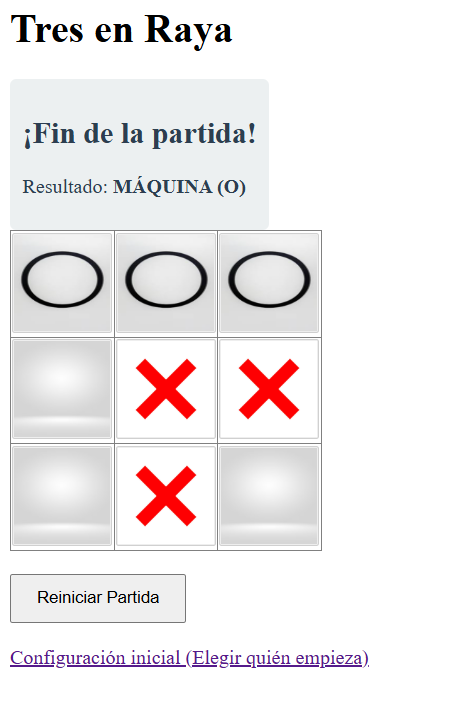

# Microproyecto 2: TicTacToe 3*3
**Integrantes:** (Luis Fernando, Carlos David, Santiago mejia)

Este proyecto consiste en una aplicación web dinámica desarrollada en Java EE (Servlets y JSP) que implementa el juego de Cuatro en Raya.

## Características
- Arquitectura MVC.
- Interfaz en español.
- Tablero extendido de 4x4 y 3*3.
- Desplegado en servidor WildFly.
